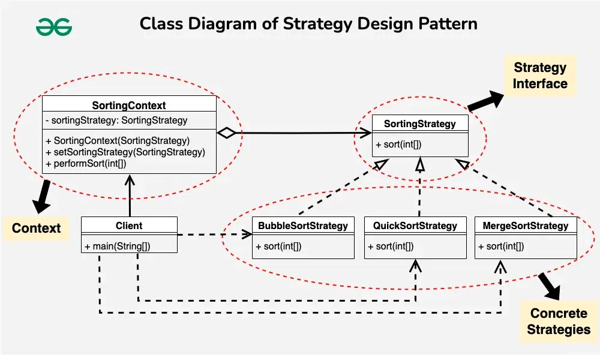

### Strategy pattern



The Strategy Pattern allows you to define a family of algorithms, encapsulate each one of them, and make them interchangeable.

```java

    public interface SortingStrategy {
        void sort(int[] array);
    }

```

```java

    // BubbleSortStrategy
    public class BubbleSortStrategy implements SortingStrategy {
        @Override
        public void sort(int[] array) {
            System.out.println("Sorting using Bubble Sort");
        }
    }

    // MergeSortStrategy
    public class MergeSortStrategy implements SortingStrategy {
        @Override
        public void sort(int[] array) {
            System.out.println("Sorting using Merge Sort");
        }
    }

```

```java

    public class SortingContext {
        private SortingStrategy sortingStrategy;

        public SortingContext(SortingStrategy sortingStrategy) {
            this.sortingStrategy = sortingStrategy;
        }

        public void setSortingStrategy(SortingStrategy sortingStrategy) {
            this.sortingStrategy = sortingStrategy;
        }

        public void performSort(int[] array) {
            sortingStrategy.sort(array);
        }
    }

```

```java

    public class Client {
        public static void main(String[] args) {
            // Create SortingContext with BubbleSortStrategy
            SortingContext sortingContext = new SortingContext(new BubbleSortStrategy());
            int[] array1 = {5, 2, 9, 1, 5};
            sortingContext.performSort(array1); // Output: Sorting using Bubble Sort

            // Change strategy to MergeSortStrategy
            sortingContext.setSortingStrategy(new MergeSortStrategy());
            int[] array2 = {8, 3, 7, 4, 2};
            sortingContext.performSort(array2); // Output: Sorting using Merge Sort
        }
    }

```
