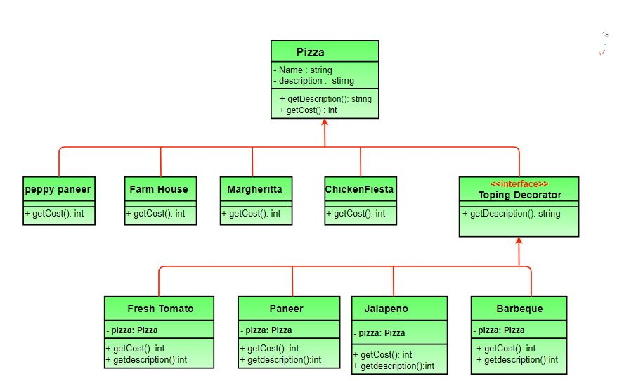

### Decorator design pattern



```code

abstract class Pizza
{
    // it is an abstract pizza
    String description = "Unkknown Pizza";

    public String getDescription()
    {
        return description;
    }

    public abstract int getCost();
}

class Margherita extends Pizza
{
    public Margherita()  { description = "Margherita"; }
    public int getCost() { return 100;  }
}

class ChickenFiesta extends Pizza
{
    public ChickenFiesta() { description = "ChickenFiesta";}
    public int getCost() { return 200; }
}


```

Add a ToppingsDecorator which extends Pizza

```code

abstract class ToppingsDecorator extends Pizza
{
    public abstract String getDescription();
}

// Concrete toppings classes
class FreshTomato extends ToppingsDecorator
{
    // we need a reference to obj we are decorating
    Pizza pizza;

    public FreshTomato(Pizza pizza) { this.pizza = pizza; }
    public String getDescription() {
        return pizza.getDescription() + ", Fresh Tomato ";
    }
    public int getCost() { return 40 + pizza.getCost(); }
}

class Paneer extends ToppingsDecorator
{
    Pizza pizza;
    public Paneer(Pizza pizza)  {  this.pizza = pizza; }
    public String getDescription() {
        return pizza.getDescription() + ", Paneer ";
    }
    public int getCost()  {  return 70 + pizza.getCost(); }
}


```

```code

// Driver class and method
class PizzaStore
{
    public static void main(String args[])
    {
        // create new margherita pizza
        Pizza pizza = new Margherita();
        System.out.println( pizza.getDescription() +
                         " Cost :" + pizza.getCost());

        // create new ChickenFiesta pizza
        Pizza pizza2 = new FarmHouse();

        // decorate it with freshtomato topping
        pizza2 = new FreshTomato(pizza2);

        //decorate it with paneer topping
        pizza2 = new Paneer(pizza2);

        System.out.println( pizza2.getDescription() +
                         " Cost :" + pizza2.getCost());

        Pizza pizza3 = new Margherita(null);    //no specific pizza
        System.out.println( pizza3.getDescription() + "  Cost :" + pizza3.getCost());
   }
}

```
